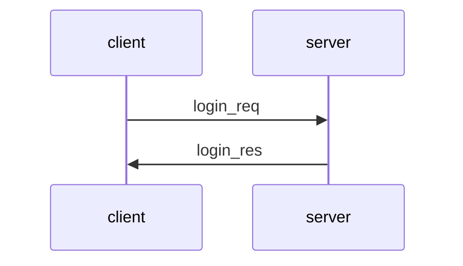
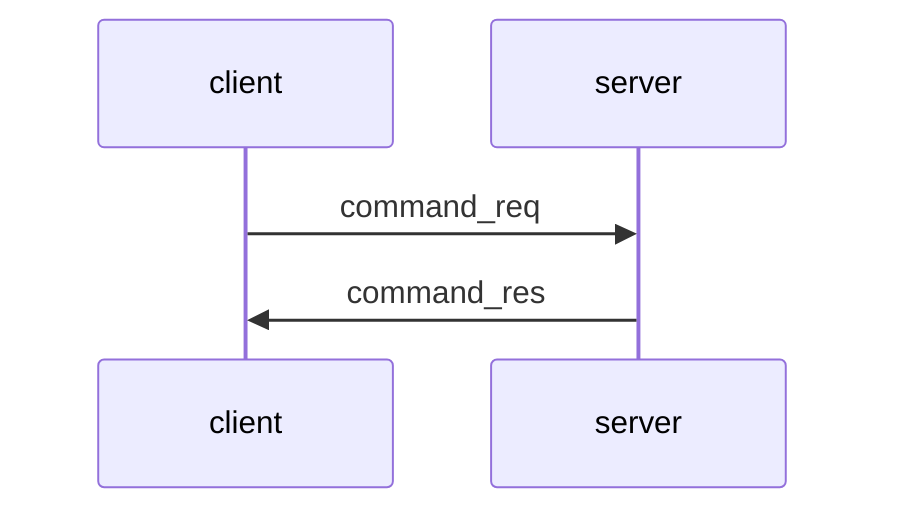
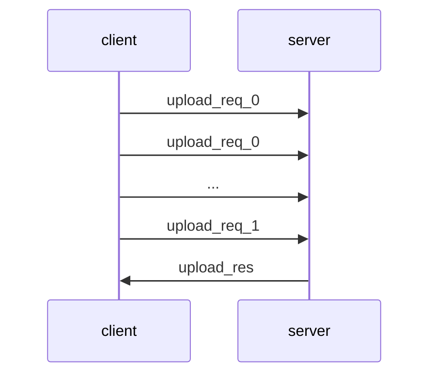
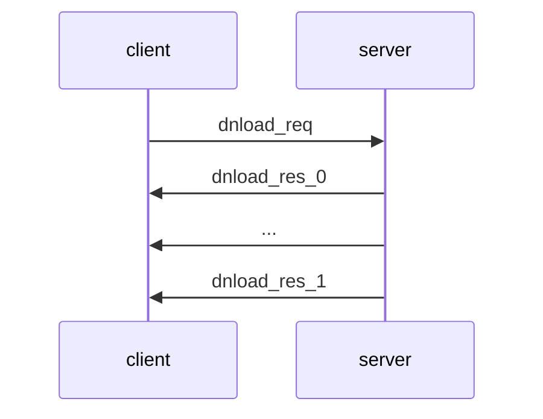

# SiFT client

## TODOs

### Init and MTP

- Load the server public key from a file
- TCP connection to the server on port 5150
- First message must be Login request (type 00 00)
- generates a fresh 6-byte random value r and a fresh 32-byte random temporary key tk using a cryptographic random number generator
- It fills in the message header fields as follows:
	- ver = `01 00`
	- typ = `00 00`
	- len is calculated as the sum of the length of the header (16), the length of the encrypted payload (same as the length of the payload), the length of the mac field (12), and the length of the encrypted temporary key (256)
	- sqn = `00 01` (i.e., message sequence numbering is started from 1) 
	- rnd = r (i.e., the 6-byte fresh random value generated before)
	- rsv = `00 00`
- It then encrypts the payload of the login request
- produces an authentication tag on the message header and the encrypted payload using AES in GCM mode with tk as the key and sqn+rnd as the nonce (here + means concatenation of byte strings)
- In this way the epd and mac fields are produced
- the client encrypts tk using RSA-OAEP with the RSA public key of the server to produce the etk field
- the client gets a response from the server (desc in Login Protocol)

Later: 
- verifies if the sequence number sqn in the message is larger than the last received sequence number,
- verifies the mac and decrypts the encrypted payload with AES in GCM mode using the final transfer key as the key and sqn+rnd as the nonce, and
- if all verifications are successful, the stored receiving sequence number is set to the sqn value received in the message header.
- A message that does not pass all verifications must be silently discarded (no error message is sent in the MTP protocol) and the connection between the client and the server must be closed

### Login Protocol

The client authenticates itself explicitely with a username and password pair, which is sent to the server in the login request message



- the client must send a login request (login_req) to the server
- if the client receives another type of message when it expects a login response, then the connection between the client and the server must be closed
- The Login Protocol is a text-based protocol, which means that message payloads are human readable texts
- All payloads must be encoded in UTF-8 coding in this version of the protocol

- _login_req_ :

The format of the login request message (MTP type `00 00`) is the following:

```
<timestamp>'\n'
<username>'\n'
<password>'\n'
<client_random>
```

where `'\n'` is the new line character. Thus, the `'\n'` character serves as a delimiter that separates the fields of the message. The fields are specified as follows:

- `<timestamp>` is an unsigned integer number converted to a string, the value of which is the nanoseconds elapsed since January 1, 1970, 00:00:00 (UTC) when the login request was generated. For instance, if Python3 is used to implement this specification, then appropriate timestamps can be obtained on Unix-like systems by calling the `time.time_ns()`  function when the login request is being generated.
- `<username>` is a string, the value of which is the username of the user attempting to log in.
- `<password>` is a string, the value of which is the password of the user attempting to log in.
- `<client_random>` is a hexadecimal number converted to a string, the value of which is a 16-byte freshly generated random value.

#### CLI / Processing

- Client provides username and password
- Generate 16-byte fresh random value using a cryptographic random number generator
- get current time (preferably right before sending out the login request message)
- Hand over to the MTP protocol
- Compute the SHA-256 hash of the payload of the login request

When receiving the login response:
- the client must verify that the request hash in the response matches the previously computed SHA-256 hash value of the payload of the login request sent to the server
- If verification fails, the client must terminate the connection
- If all verifications were successful, then both the client and the server compute a 32-byte final transfer key for the MTP protocol from the concatenation of the client_random and the server_random as initial key material, and the request_hash as salt using the HKDF key derivation function with SHA-256 as the internal hash function.
- The derived final transfer key is passed to the MTP protocol entity such that all subsequent MTP messages must be protected by this key

### Command Protocol

Commands Protocol is responsible for sending the file commands of the client to the server and sending response messages to these commands.



- client must send a command request (command_req) to the server
- When the client does not want to send any more command requests, it should close the connection
- if the client receives another type of message when it expects a command response, then the connection between the client and the server must be closed
- The Commands Protocol is a text-based protocol, which means that message payloads are human readable texts
- All payloads must be encoded in UTF-8 coding in this version of the protocol

- _command_req_ :

The format of the command request message (MTP type `01 00`) is the following:

```
<command>'\n'
<param_1>'\n'
...
<param_n>
```

- The fields must be separated by the '\n' delimiter character
- The <command> field can contain the following strings (without the apostrophes) in this version of the protocol: 'pwd', 'lst', 'chd', 'mkd', 'del', 'upl', 'dnl'
The pwd and lst commands have no paramters. The other commands must have the following parameters:
- chd (change working directory) command:
	-  `<param_1>` is a string, the value of which is the name of the directory to change to on the server. Path names may be supported by implementations, but this is not mandatory. If path names are not supported, then this field should contain the name of a directory within the current working directory, or '..' (without apostrophes) for moving up in the directory hierarchy. Implementations should pay attantion to prevent moving outside of the root directory associated with the currently logged in user.
-  mkd (make directory) command:
	-  `<param_1>` is a string, the value of which is the name of the directory to be created on the server. Path names may be supported by implementations, but this is not mandatory. If path names are not supported, then the new directory with the given name is created inside the current working directory. If a directory with the same name already exists, then the mkd command should fail. Implementations should pay attantion to prevent creating a new directory outside of the root directory associated with the currently logged in user.
-  del (delete file or directory) command:
	-  `<param_1>` is a string, the value of which is the name of the file or directory to be deleted on the server. Path names may be supported by implementations, but this is not mandatory. If path names are not supported, the file or directory of the given name inside the current working directory is deleted. Directories should only be deleted if they are empty, otherwise the del command should fail. Implementations should pay attantion to prevent deleting a file or directory outside of the root directory associated with the currently logged in user.
-  upl (upload file) command:
	-  `<param_1>` is a string, the value of which is the name of the file to be uploaded on the server. Path names may be supported by implementations, but this is not mandatory. If path names are not supported, the file is uploaded into the current working directory on the server and the created file gets the given name. Only file upload is supported, directories cannot be uploaded by this version of the protocol. Implementations should pay attantion to prevent uploading a file outside of the root directory associated with the currently logged in user.
	-  `<param_2>` is an unsigned integer converted to a string, the value of which is the size of the file to be uploaded in bytes.
	-  `<param_3>` is a hexadecimal number converted to a string, the value of which is the SHA-256 hash of the content of the file to be uploaded.
- dnl (download file) command:
	- `<param_1>` is a string, the value of which is the name of the file to be downloaded from the server. Path names may be supported by implementations, but this is not mandatory. If path names are not supported, the file of the given name in the current working directory on the server is downloaded to the client. Only file download is supported, directories cannot be downloaded by this version of the protocol. Implementations should pay attantion to prevent downloading a file from a directory outside of the root directory associated with the currently logged in user.

- To display: The commands pwd, lst, chd, mkd, and del may fail on the server for various reasons, in wich case the <result_1> field of the corresponding command response must be the string 'failure' (without the apostrophes) and the <result_2> field must contain a string indicating the casue of the failure (i.e., sort of an error message). The commands upl and dnl may be rejected by the server for various reasons (e.g., the file to be uploaded is too large, the file to be downloaded does not exist, etc.), in which case the <result_1> field of the corresponding command response must be the string 'reject' (without the apostrophes) and the <result_2> field must contain a string indicating the casue of the rejection (i.e., sort of an error message).
(The format of the command response message (MTP type 01 10)) Any other case the result1 is success or accept
- pwd command:
	- `<result_2>` is a string, the value of which is the path of the current working directory on the server.
- lst command:
	-  `<result_2>` is string, the value of which is the Base64 encoding of the listing of the content of the current working directory on the server.
- dnl command
	-  `<result_2>` is an unsigned integer converted to a string, the value of which is the size of the file to be downloaded in bytes.
	-  `<result_3>` is a hexadecimal number converted to a string, the value of which is the SHA-256 hash of the content of the file to be downloaded.

- each command response must contain the SHA-256 hash of the corresponding command request (converted to a byte string) in the <request_hash> field of the response, and clients must verify this.
- If this verification fails, the client must close the connection
- Note that the commands upl and dnl do not actually perform the file upload and download operation itself: they only prepare the actual file upload and download operations which are handled by the Upload and Download Protocols, respectively

### Upload Protocol

Upload Protocol is responsible for executing an actual file upload operation. It must only be used by the server after sending an 'accept' response to an upl command in the Commands Protocol, and it must only be used by the client after receiving an 'accept' response to an upl command in the Commands Protocol



- consists of 2 or more message transfers, depending on the number of file fragments to be uploaded
- The client typically does not upload the entire file in a single message, but it divides the file into fragments and uploads the fragements in upload request messages
- two types of upload requests: upload_req_0 (MTP type 02 00) and upload_req_1 (MTP type 02 01). File fragments that are followed by further file fragments are uploaded in upload_req_0 messages, and the last file fragment, which is not followed by any more file fragment, is uploaded in an upload_req_1 message at the end
- Note that if the file is small and the entire file fits in a single fragment, then the client sends only a single upload_req_1 message
- The fragment size cannot be negotiated in this version of the protocol, therefore implementations conforming this specification must use the fixed fragment size of 1024 bytes
- upload_req_0 and upload_req_1: Both types of upload request messages (MTP types 02 00 and 02 01) contain the raw bytes of the file fragment carried in the message

- The client splits the file to be uploaded into fragments of the specified size
- uploads these fragments sequentially in upload request messages
- the last fragment is uploaded in a message of type upload_req_1
- all preceeding fragments (if any) are uploaded in messages of type upload_req_0
- During this operation, the client should also compute the size of the uploaded file and its SHA-256 hash value
- the client receives the upload response message, it must verify that the file hash received matches the one previously computed during the upload. 
- If the verification fails, the client should close the connection with the server.

### Download Protocol

Download Protocol is responsible for executing an actual file download operation. It must only be used by the server after sending an 'accept' response to a dnl command in the Commands Protocol, and it must only be used by the client after receiving an 'accept' response to a dnl command in the Commands Protocol



- consists of 2 or more message transfers, depending on the number of file fragments to be downloaded
- two types of download responses: dnload_res_0 (MTP type 03 10) and dnload_res_1 (MTP type 03 11)
- File fragments that are followed by further file fragments are downloaded in dnload_res_0 messages, and the last file fragment, which is not followed by any more file fragment, is downloaded in a dnload_res_1 message at the end
- The client learns that the download is complete by the fact of receiving a dnload_res_1 message
- Note that if the file is small and the entire file fits in a single fragment, then the server sends only a single dnload_res_1 message, and this completes the entire download operation.
- Before the actual download of the file, the client must indicate if it is ready for receiving the file or prefers cancelling the file download in the dnload_req message sent to the server at the beginning of the Download Protocol

- dnload_req: The download request message (MTP type 03 00) has a text-based format, i.e., it contains human readable text, encoded in UTF-8 coding.
- The message contains a single field, which has the value 'Ready' or 'Cancel' (without the apostrophes).  'Ready' means that the client is ready for the download, whereas 'Cancel' means that, despite the fact that the download request was accepted by the server, the client does not want to proceed, and it cancels the operation.
- dnload_res_0 and dnload_res_1: Both types of download response messages (MTP types 03 10 and 03 11) contain the raw bytes of the file fragment carried in the message

- When the client receives a download response in the Commands Protocol, it lears from that response the size and hash of the file to be downloaded
- Based on these, it may decide to proceed with the download or cancel it (e.g., it may ask the user if he/she wants to download the file given its size and its hash)
- The decision of the client is sent to the server in the dnload_req message
- The client receives the download response messages and saves their content into a file. 
- When the client receives a dnload_res_1 message, it knows that the download is complete.
- During the download operation, the client computes the size of the file received and its SHA-256 hash value. It must then verify that the file hash received matches the one previously received in the Commands Protocol as part of the server's response to the client's download request that triggered this download in the first place
- If the verification fails, the client may close the connection with the server or simply notify the user that the file received has a hash value that does not match the one previously computed by the server


